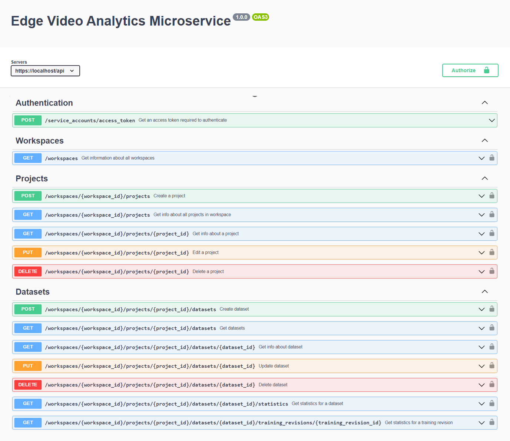

#############
API Reference
#############

Vision AI microservices are described using OpenAPI specification. We provide you with two ways to view the API specification for each microservice: 

* :ref:`Swagger UI <EVAM_Swagger>`: Use swagger UI to visualize and interact with the API's resources
* :ref:`Docs UI <EVAM_Docs>`: Read-ony visualization of the API 

.. _EVAM_Swagger:

**********
Swagger UI
**********

Edge Video Analytics microservice individual API details can be found `here`_.

.. _here: https://docs.nvidia.com/jetson/jps/vst_API/

Ipsum consequat velit voluptate proident cillum. Aliquip in irure cupidatat reprehenderit excepteur enim enim duis commodo eu.

.. _EVAM_Docs:

*******
Docs UI
*******

Ipsum consequat velit voluptate proident cillum. Aliquip in irure cupidatat reprehenderit excepteur enim enim duis commodo eu. Lorem officia deserunt esse ad. Incididunt cillum elit non aute ad.

.. openapi:: OPENAPI.yml